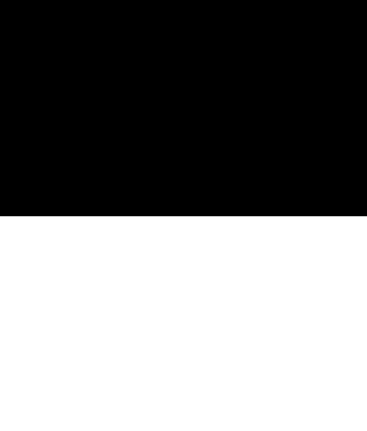
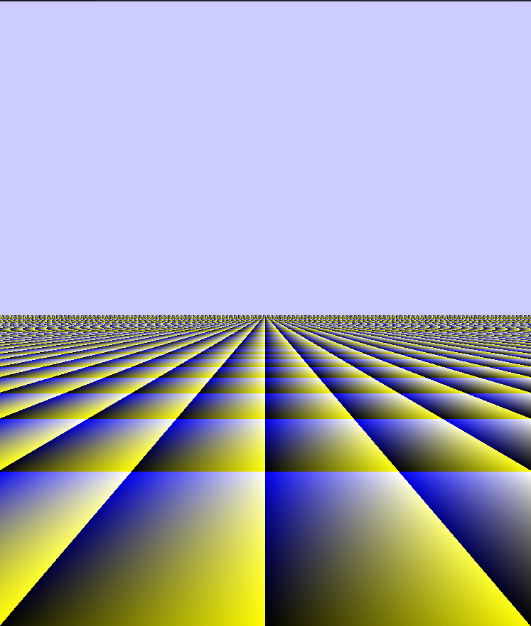
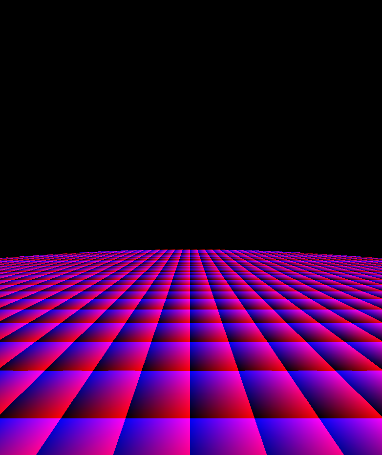
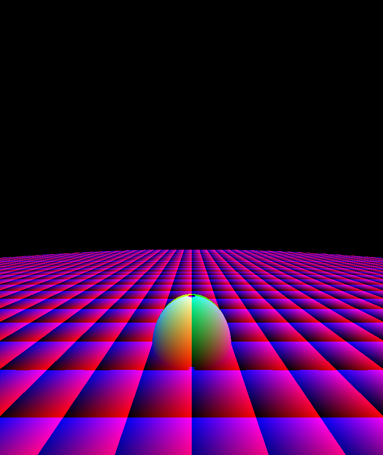
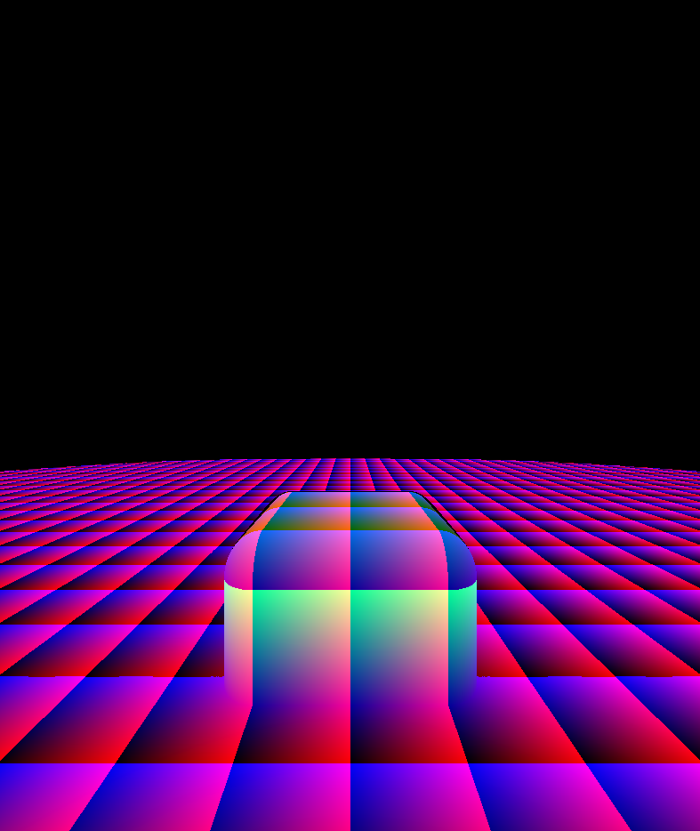
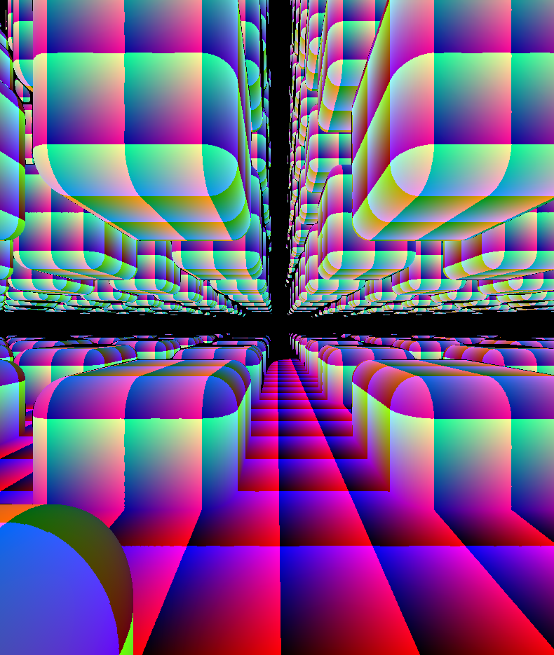
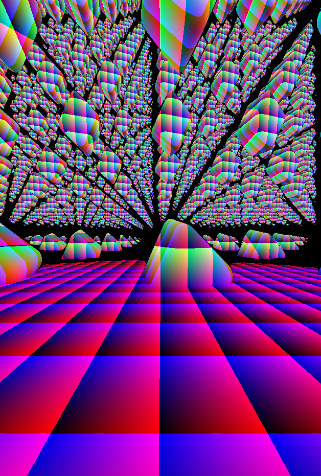
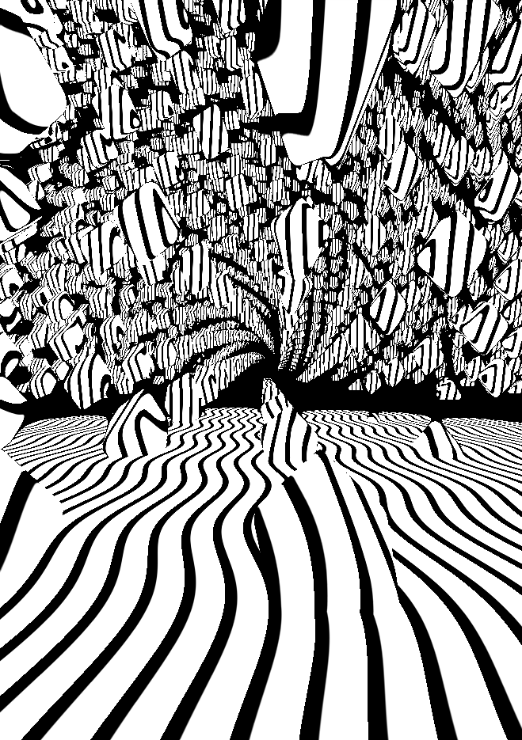
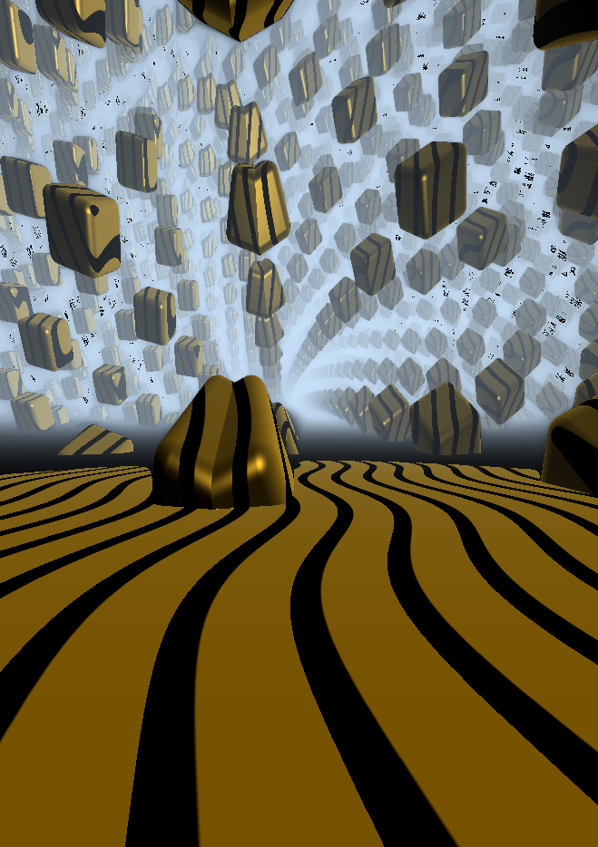

## Intro

This files are just the transcript of this [live conding session](https://www.youtube.com/watch?v=s6t0mJsgUKw) by Rémi Papillié.

You can run each file in Visual Studio Code + [Shader Toy extension](https://marketplace.visualstudio.com/items?itemName=stevensona.shader-toy). After the extension is installed, go to View -> Command Palette -> shoew glsl preview

## Files

**00.glsl**

Use the intersection function to draw a plane. Set the coordinate system to the center of the screen

***

**01.glsl**

use `fract` to draw the quare on the plane and give the sense of depth. Do not draw the squares if the distance is less than 0, and therefore there wa no intersection

***

**02.glsl**

Enter Ray Marching. Initially the color is black. In the loop, if there is a collision (meaning, if the SDF of the scene is less than EPSILON), calculate the color and break. Otherwise, advance one step forward.

***

**03.glsl**

Add a sphere. Introduce the `sphere` function, use `min` to merge two object together, in this case the sphere and the plane.

***

**04.glsl**

Move the camera around, using `sin(iGlobalTime)` and make the box rounded.

***

**05.glsl**

use the modulo function to multiplicate the boxes. See `mod(pos + offset/2., offset) - offset/2.`

***

**06.glsl**

Introduce the `rotate` function and rotate the boxes. Try out different types of rotation. See how `pos.x = abs(pos.x)` deforms the box.

***

**07.glsl**

Have a look at the `albedo` function, see how it is used to add white stripes on the plane and on the cubes. Try out different values for `pos *= 0.5`, like `pos *= 10.0`

***

**08.glsl**

This file is about light. A light position and direction is defined in `lightDistance` and `lightDirection`. Then there is a method to calculate the normal called `calculateNormal`, a method to calculate the `diffuse` light, and one to calculate the `specular` light. At the end a `fogFactor` is added.
